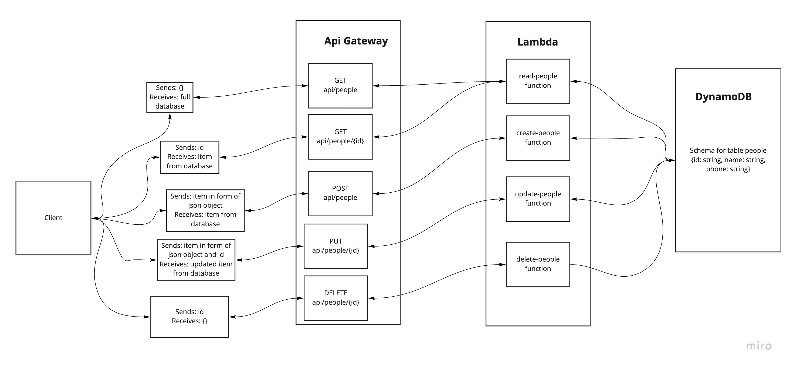

# serverless-api

## Github PR
* https://github.com/gerstej9/serverless-api/pulls?q=is%3Apr+is%3Aclosed

## Github Actions
https://github.com/gerstej9/serverless-api/actions

## API Gateway URL
https://5sj9nuiwd2.execute-api.us-west-2.amazonaws.com/test/people

## UML

## Class notes
* Learn how to use DynamoDB and dynamoose
* Learn how to use AWS API Gateway
* Learn how to integrate DynamoDB, Lambda, and API Gateway
* Learn how to test deployed serverless API